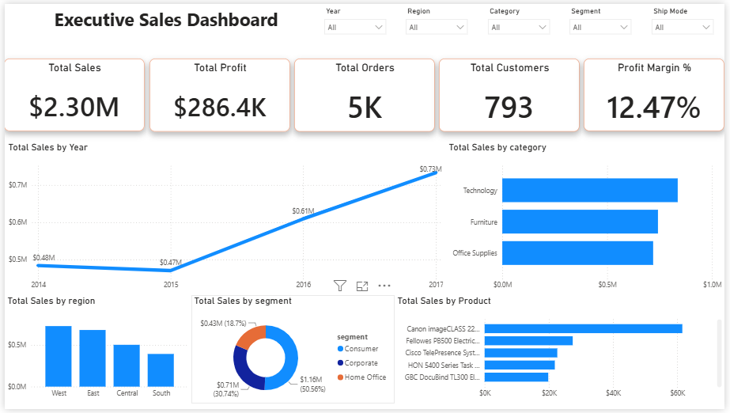
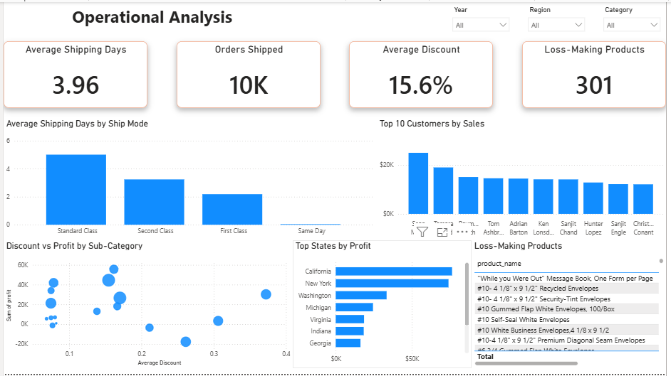

# Sales Performance Dashboard

## Project Overview

This project analyzes retail sales data from a Superstore dataset using **Python, PostgreSQL, SQL, and Power BI**. The goal was to build an end-to-end analytics solution that transforms raw sales records into interactive business dashboards for executive and operational decision-making.

## Business Objectives

* Measure overall sales and profitability
* Track sales trends over time
* Identify top-performing product categories and regions
* Analyze customer segments and top customers
* Evaluate shipping efficiency
* Detect loss-making products and operational issues

## Tools & Technologies

* **Python (Pandas)** – data cleaning and transformation
* **Jupyter Notebook** – exploratory analysis
* **PostgreSQL** – data storage and SQL querying
* **SQL** – KPI calculations and business analysis
* **Power BI** – interactive dashboard development
* **Git & GitHub** – version control and portfolio publishing

## Project Workflow

1. Imported raw Superstore sales data
2. Cleaned and standardized column names in Python
3. Created additional fields such as:

   * Shipping Days
   * Year
   * Month
   * Profit Margin
4. Loaded the cleaned dataset into PostgreSQL
5. Performed SQL analysis for KPIs and business insights
6. Connected Power BI directly to PostgreSQL
7. Built two interactive dashboards:

   * Executive Sales Dashboard
   * Operational Analysis Dashboard

## Executive Dashboard

**Key KPIs**

* Total Sales: **$2.30M**
* Total Profit: **$286.4K**
* Total Orders: **5,009**
* Total Customers: **793**
* Profit Margin: **12.47%**

**Visuals**

* Sales Trend by Year
* Sales by Category
* Sales by Region
* Sales by Customer Segment
* Top 10 Products

## Operational Dashboard

**Key KPIs**

* Average Shipping Days: **3.96**
* Orders Shipped: **9,994**
* Average Discount: **15.6%**
* Loss-Making Products: **301**

**Visuals**

* Shipping Performance by Ship Mode
* Top 10 Customers by Sales
* Discount vs Profit Analysis
* Top States by Profit
* Loss-Making Products Table

## SQL Analysis

The SQL analysis included:

* Data validation
* KPI calculations
* Sales trend analysis
* Category and sub-category performance
* Regional performance
* Customer segment analysis
* Shipping analysis
* Top products and customers
* Loss-making product detection

## Key Business Insights

* **Technology** generated the highest sales among product categories.
* The **West** region contributed the largest share of revenue.
* **Consumer** customers accounted for the largest portion of total sales.
* **Standard Class** shipping had the longest average delivery time.
* Over **300 products generated negative total profit**, indicating pricing or discount optimization opportunities.

## Author

**Felix Owusu Brobbey**

Bachelor of Technology (Information Technology)
Takoradi Technical University

Aspiring **Data Analyst | Software Engineer**